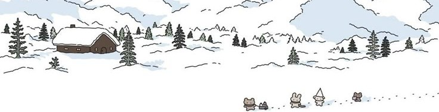

  

<h1 align="center">Hey there, I'm <strong>Ashvij</strong> 👋</h1>

  <em>curator of random ideas ❄️ explorer of cozy code spaces ✨</em> 
  <em>I build whatever I dream up — through any stack I can wield.</em>

---

### 🧠 Philosophy

I love curating *random ideas* — transforming sparks of curiosity into small, complete worlds.  
Sometimes they’re digital gardens, sometimes chaotic prototypes, sometimes calm pixel spaces.  
I follow my curiosity more than any roadmap.  
Tinkering with random prototypes and cozy interfaces.  
Learning by building — always experimenting.  

> 💬 _“It’s not about shipping the perfect product — it’s about discovering what could exist.”_

  

### ⚙️ My Stack of Wonder

  
  
  
  
  
  
  
  
  
  
  
  
  
  
  
  
  
  
  
  
  
  
  
  
  
  

  <em>...and whatever else helps an idea take shape.</em>

  <svg width="100%" height="80" viewBox="0 0 1200 80" xmlns="http://www.w3.org/2000/svg" preserveAspectRatio="none">
    <path d="M0,30 C300,80 900,0 1200,50 L1200,80 L0,80 Z" fill="#6AA5F7" opacity="0.2">
      <animate attributeName="d" dur="10s" repeatCount="indefinite"
        values="
        M0,30 C300,80 900,0 1200,50 L1200,80 L0,80 Z;
        M0,40 C300,60 900,20 1200,30 L1200,80 L0,80 Z;
        M0,20 C300,90 900,10 1200,40 L1200,80 L0,80 Z;
        M0,30 C300,80 900,0 1200,50 L1200,80 L0,80 Z" />
    </path>
    <g fill="white" opacity="0.8">
      <circle cx="100" cy="10" r="2">
        <animate attributeName="cy" values="10;80" dur="6s" repeatCount="indefinite" />
        <animate attributeName="cx" values="100;120" dur="6s" repeatCount="indefinite" />
      </circle>
      <circle cx="400" cy="15" r="1.5">
        <animate attributeName="cy" values="15;80" dur="8s" repeatCount="indefinite" />
        <animate attributeName="cx" values="400;380" dur="8s" repeatCount="indefinite" />
      </circle>
      <circle cx="800" cy="5" r="2">
        <animate attributeName="cy" values="5;80" dur="7s" repeatCount="indefinite" />
        <animate attributeName="cx" values="800;820" dur="7s" repeatCount="indefinite" />
      </circle>
      <circle cx="1100" cy="12" r="1.8">
        <animate attributeName="cy" values="12;80" dur="9s" repeatCount="indefinite" />
        <animate attributeName="cx" values="1100;1080" dur="9s" repeatCount="indefinite" />
      </circle>
    </g>
  </svg>

### 📫 Let’s Connect

  
  
  
  

---

  
   
  

  

  <em>“Curate ideas. Build tiny worlds.” ❄️</em>

